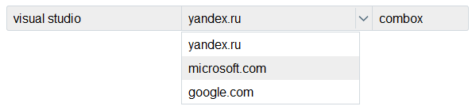

ComboxJs
========
#####jQuery UI widget
---------------------

Comboxjs is a widget qlueing together several controls in one. It will help you to insert a few controls of a one context into your design. That's how it's going to look like:  

In order to use it, all you have to do is describing all the controls in the layout and wrapping in &lt;div&gt;
Then just create the combox on this &lt;div&gt; <code>$('div').combox()</code> 

Don't forget to indicate ID's for all the controls that you are going to glue together. Combox is capable of glueing together input[type=text] and select

For now, the quantity of controls is unlimited.

Use it if you need it! Good luck!
